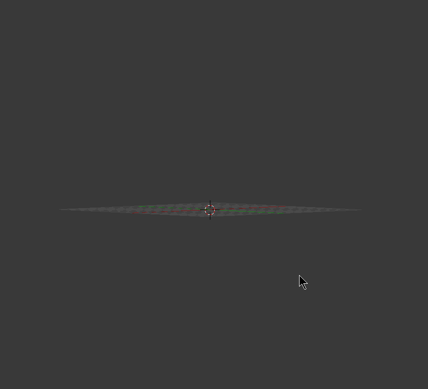

# elfin-ui

Elfin-ui is like a protein CAD. It's a Blender addon that serves as [elfin](https://github.com/joy13975/elfin)'s frontend user interface for assembling large proteins using protein modules.

[Jump to: Getting Started](#getting-started)
[Jump to: FAQ](#FAQ)

## Goals

 * Enable full assembly design through manual manipulation of modules and networks.
 * Enable partially automated (with [elfin-solver](https://github.com/joy13975/elfin-solver)) design through path guides.

## Getting Started

Get [Blender v2.79b](https://builder.blender.org/download/).

This addon was developed for and tested on Blender v2.79. 

Beware that Blender v2.8 (now beta) will probably introduce significant changes so it's best to stay away for now.

After you've downloaded Blender, run it and go to `File` > `User Preferences` and click `Save User Settings`. This has to be done at least once to create your Blender use profile.

Next, refer to: [Tutorial With GIFs](resources/tutorial/README.md)

## TODO:

### Must-Haves
 * Export to Elfin Core format
 * Import Elfin core output into scene

### Nice-to-Haves
 * Mirrored joining? Sounds complicated.
 * Confirm deletion caused by collision
 	* Collision detection using single module 3D models are not very accurate (currently each module is shrunken to 85% before checking).

### Feasibility N/A
 * Select previous module upon module delete
 * Auto-seek extrusion
 	 * List all extrudable termini of the network that the selected module belongs to.
	 * If there are hubs in the network there might be multiple heads. In this case ask the user to choose one.
		
### Once Blender gets an API upgrade
 * Hooking callback upon object deletion or entrance to scene
 	 * In v2.79 there are no callback hooks for object deletion/entrance.
 	 * Currently implemented using a watcher that checks the scene objects at 100ms intervals, which can be flacky under rare circumstances e.g. if the user uses a script to edit the scene at non-human speeds. For the most part this works, but is obviously not the best approach.
 * Hub symmetry enforcement
 	 * In v2.79, we're not able to create custom modifiers in Python.
 	 * Currently implemented using mirror-linking.

## FAQ:
<b>1. What are networks?</b>

Networks are groups of modules or groups of path guide primitives that exist so that elfin can keep track of which modules or path guides are "connected". The most important thing to keep in mind is that elfin-ui locks the transformation of individual modules - see #3. However, you can freely transform individual path guide "joints".

<b>2. Why do we need networks?</b>

In order to preserve the interface relationship of each connected group of modules, and to ease to processing when exporting. Creation and splitting of networks are automatic, so you don't need to worry about them. Just keep in mind that you must select the parent when attempting a transform - see #3.

<b>3. Why can't I move or rotate any module?</b>

It is intentionally disabled, because the transforming of individual modules break the spatial relatinoship between modules that elfin's assembly logic relies on.

The correct way to transform modules is to select the parent object (i.e. via `Select Parent` or shortcut <kbd>shift</kbd>+<kbd>G</kbd>+<kbd>P</kbd>) and then move or rotate the whole network. If you want to move an individual module, then by logic it must be severed from the network (i.e. via `Sever Network`) it originally belonged to and form a new, separate network with just that module. Transform that network, then join the networks back together when you're done.

<b>4. Why can't I extrude into a symmetric hub or join networks that involve symmetric hub(s)?</b>

It is intentionally disabled. It is technically possible, but not logical, because any network that involves a symmetric hub will have the hub as the center piece due to the "arm-symmetry".

When you're creating a network that involves a symmetric hub, you should start with that symmetric hub as the first module. From there on, extrusions on each of the arms of the hub will be automatically mirrored.

<b>5. What is mirror-linking?</b>

It is a extrusion/deletion mirroring mechanism originally implemented for symmetric hubs. Extrude and delete operations on any one of a group of mirror-linked modules are automatically copied across. Extruded modules are also automatically mirror-linked so further extrusions are also copied as expected.

It's sometimes useful to manually create mirror-linked groups that extrude together. To do so, use `Link by Mirror`. There are also a couple of other mirror linking operators - see [tutorial](resources/tutorial/README.md).

## Don't do's
<b>Can I change module object settings?</b>

No, except for the material color. Especially, if the transform settings are modified, it's very likely that you will break elfin's assumption about module spatial relationship and the result is undefined.

<b>Can I scale any object?</b>

No. The scale must be kept constant so that the calculation between PyMol data and Blender are correct. It's just like how you cannot just scale a lifesize protein up 100x.