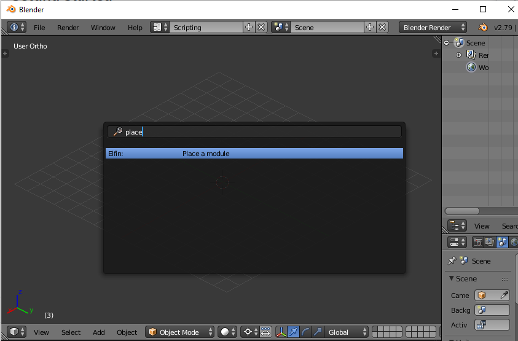

# Elfin UI

A Blender addon that serves [elfin](https://github.com/joy13975/elfin)'s frontend user interface for building large proteins using protein modules.

## [Skip to: Getting Started](#getting-started)

## Goals

 * Enable full assembly design through manual manipulation.
 * Enable partially automated (with [elfin-solver](https://github.com/joy13975/elfin-solver)) design through path guides.

## Development Notes:

 1. Symmetric hubs
 	* There are only two symmetric hubs in the database right now. 
 	* All "arms" of a symmetric hub must be identical and because of this, logically any network can only have zero or one symmetric hub "core".
    * Should a symmetric hub network be allowed to have asymmetric hubs in its arms? 
        * This is currently allowed
        * In strctures like `<asy_hub - sym_hub - asy_hub>` should the symetric property propogate and force  each arm of the asy_hub to also be identical?

 2. Mirrored modules
 	* Symmetric hub extrusions are automatically mirrored.
 	* Other modules can be mirror-linked by the Link by Mirror operator.
 	* When extruding from a module that has "mirrors" to other modules of the same protoype, the newly extruded modules will also be mirror-linked together.
 		* Only intra-network auto mirroring is supported.
 		* For inter-network simultaneous extrusion, first select one member of each mirror-link group, and then use the Select Mirror Links operator.

### TODO: Current Working On:
 * Link by Mirror and Select Mirror Links operator
 * Track symmetric mother hub? Is this necessary? 
 * Make C/N term extrusion share more code

### TODO: Must-Haves
 * Enforce hub symmetry through modifier-like behaviour
 * Define auto-design "work sites" by drawing path guides
 * Export to Elfin Core format

### TODO: Nice-to-Haves
 * Pull-Join: join two module networks by pulling first selected network to the second one.
	 1. Check compatibility
	 2. Then do a frame re-shift for all objs in first network based on the selected module
	 * Allow pull-join having one side being symmetric core?
 * Allow user to confirm deletion when collision is detected. Collision detection using single module 3D models are not very accurate (currently each module is shruken to 85% before checking).

### TODO: Maybe?
 * Incremental selection
 	 * Don't think Blender has API for this yet but we could add an operator.
 * Select previous module upon module delete (possible ?)
 * Auto-seek extrusion
	 * If there are hubs in the network there might be multiple heads. In this case ask the user to choose one.
		
### TO-CHANGE: Once Blender gets an API upgrade
 * Hooking callback upon object deletion or entrance to scene
 	 * In v2.79 there are no callback hooks for object deletion/entrance.
 	 * Currently implemented using a watcher at 100ms, which can be flacky under rare circumstances e.g. if the user uses a script to edit the scene at non-human speeds.
 * Hub symmetry enfrocement
 	 * In v2.79, we're not able to create custom modifiers in Python.
 	 * Currently implemented using \<TBD\>

## Getting Started

Get [Blender v2.79b](https://builder.blender.org/download/).

This addon was developed for and tested on Blender v2.79. 

Beware that Blender v2.8 (now beta) will probably introduce significant changes so it's best to stay away for now.

## Installing (Linux/MacOS/WSL)

`./install`

For pure Windows (non-WSL), either copy the `elfin` folder to your Blender's addon directory or create a symlink via `mklink` or [Shell Link Extension](http://schinagl.priv.at/nt/hardlinkshellext/linkshellextension.html)

After installing, open Blender and go to `File > User Preferences > Add-ons` and search for `Elfin`. If the installation was successful there should be a `Elfin: Elfin UI`. Tick the box and make sure to `Save User Settings` (bottom-left).

## Using the Addon

You will access functionalities of the Elfin UI addon via what Blender calls "operators".

In effect, when your mouse is within the viewport, you can hit <kbd>space</kbd> to bring up a search menu that lets you type in the name of the operator.

Currently available (and useful) operators:

 * <b>Place</b> a module
    * Only available when nothing is selected in the scene
 * <b>Extrude N</b> (add a module to the nterm)
 	* Only available if one ore more modules are selected in the scene
 * <b>Extrude C</b> (add a module to the cterm)
 	* Only available if one ore more modules are selected in the scene

You don't have to type the full name of the module. For example, "ex n" will bring up the <b>Extrude N</b> operator.

Each of the above operators will prompt you with a filtered list of actionable modules. For instance if a single module has already got an N and a C neighbour, then the extrusion operators will not allow extruding unless its neighbours are deleted.

Even though there are just three operators now, they can be quite powerful when combined with mirror-linked modules (very soon upcoming new operator). Also with Blender's default object manipulating functions, interesting designs can already be built.

Useful Blender shortcuts:
 * <kbd>a</kbd> toggle select all/deselect all.
 * <kbd>x</kbd> to delete selection (with confirmation).
 * <kbd>r</kbd> to rotate selection.
 * <kbd>g</kbd> to translate selection.
 * <kbd>s</kbd> to scale selection. <b>BUT! in Elfin UI scaling should never be done on modules.</b>
 * <kbd>t</kbd> to toggle left-hand-side panel (which has the operator options).
 * <kbd>n</kbd> to toggle right-hand-side panel (which has object properties like location, rotation, etc)

In the module list, you will see that the name of a module is bounded by two period marks. These marks are sentinels so that it's easy for you to search exactly which module to place. Try just typing "D4" in the <b>Place</b> operator, and see what happens when you type ".D4" or "D4." or ".D4.".

The first letter, if there is one, denotes the <b>C Terminus</b> chain ID of the extrusion. This is needed because hub modules have more than one chain to extrude to and from.

The last letter is therefore the <b><N Terminus/b> chain ID in the to-be-extruded module.

<b>WARNING</b>: any design created as of now will most likely not be able to be properly exported to elfin's internal data format when the export function is available. This is because Blender objects created using an old version of the addon will not get new properties even if the addon is updated. The design will need to be re-created.

## Updating the Module Library

If in any case the module library was lost, modified, or became outdated, do:

`./fetch_library`

