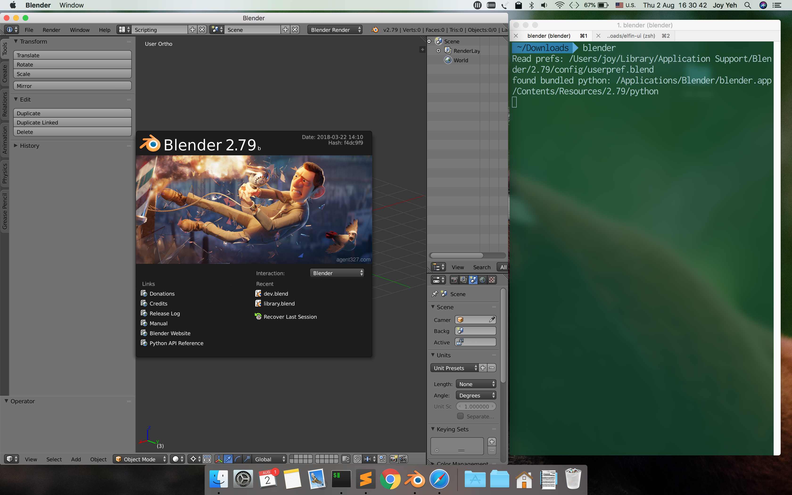
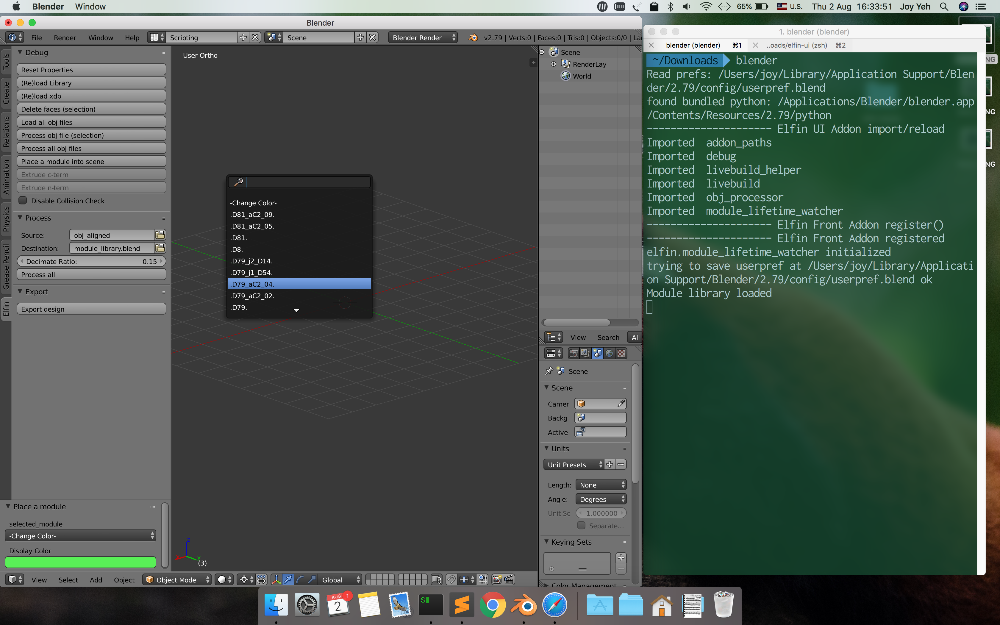
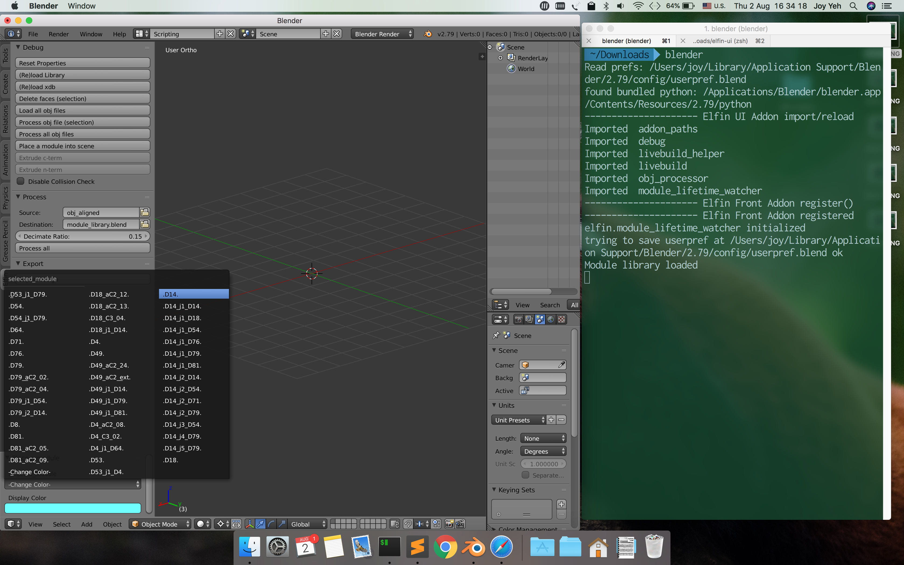
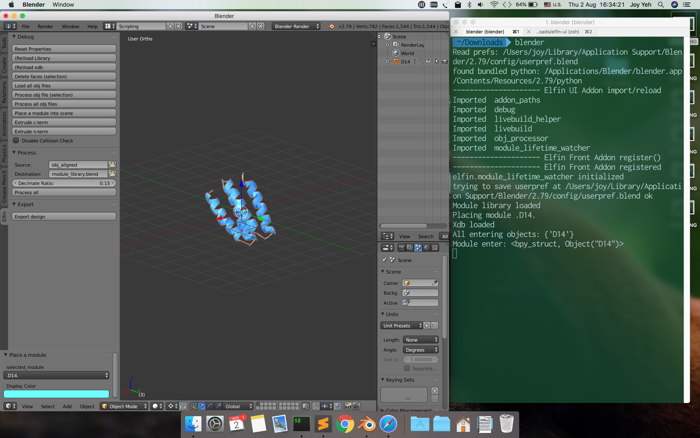
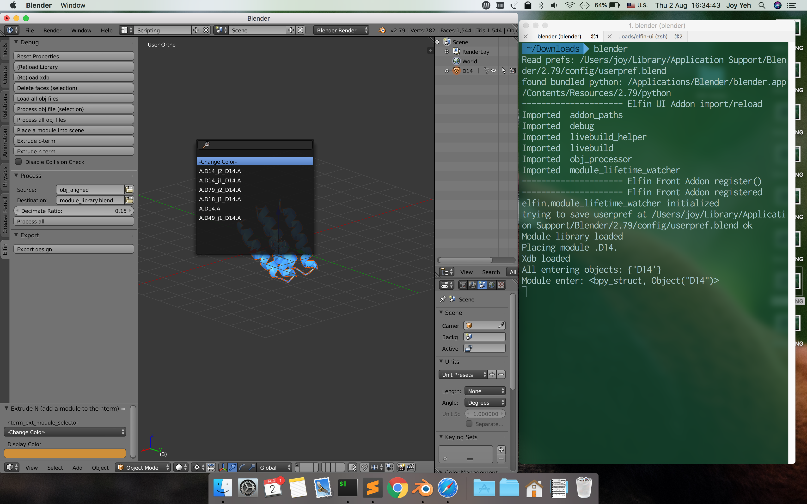
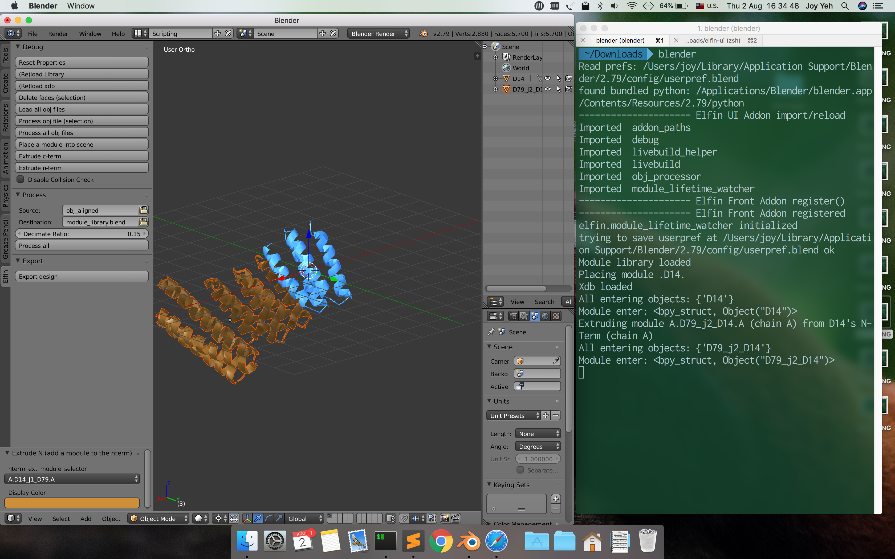
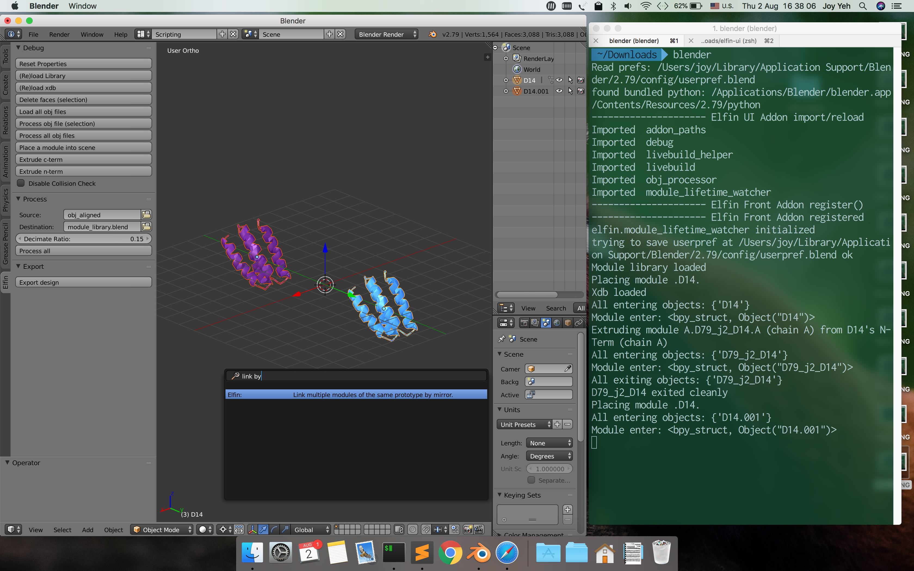
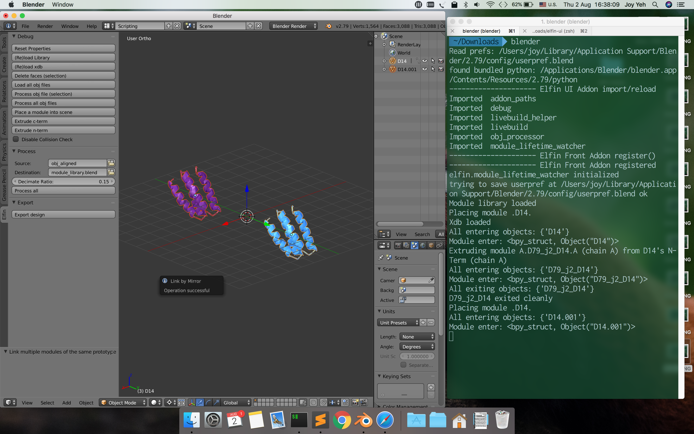
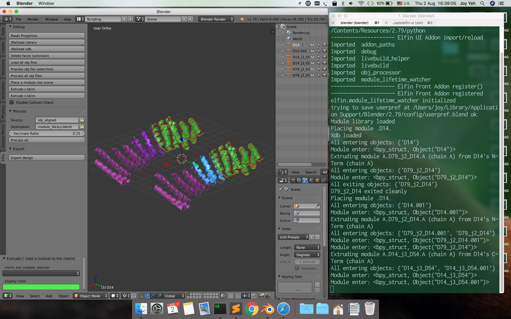

## Installing (Linux/MacOS/WSL)

`./install`

For "pure" Windows (non-WSL), either copy the `elfin` folder to your Blender's addon directory or create a symlink via `mklink` or [Shell Link Extension](http://schinagl.priv.at/nt/hardlinkshellext/linkshellextension.html)

After installing, open Blender and go to `File > User Preferences > Add-ons` and search for `Elfin`. If the installation was successful there should be a `Elfin: Elfin UI`. Tick the box and make sure to `Save User Settings` (bottom-left).

## Updating the Module Library
The module library files are automatically fetched by `./install` but if in any case the module library was lost, modified, or became outdated, do:

`./fetch_library`

## Warnings Before Use
Any design created as of now will most likely not be exportable to elfin's internal data format when the export function is available. This is because Blender objects created using an old version of the addon will not get new properties even if the addon is updated. The protein design will need to be re-created.

We could possibly make future changes backword compatible by implementing a remove-all, re-add all function but right now this does not exist yet so be warned nonetheless.

## Using the Addon
All functionalities of the Elfin UI addon are accessed via what Blender calls "operators".

Effectively, when your mouse is within the viewport, you can hit <kbd>space</kbd> to bring up a search menu that lets you type in the name of the operator.

<p align="center">

</p>

# Installing elfin-ui

Download elfin-ui and install it using the following commands:

```
git clone git@github.com:joy13975/elfin-ui
cd elfin-ui
./install
```

Make sure to select v2.79 when asked by the script.

<p align="center">

</p>

# Enabling elfin-ui

Enable the addon in Blender's user preferences (`File` > `User Preferences` > `Add-ons`). Search for `elfin` and after ticking the box make sure to hit the `Save User Preferences` button.

Before enabling, your Blender probably looks like:
<p align="center">

</p>

After enabling, your Blender should look like:
<p align="center">

</p>

Notice that the left-hand-side panel now has an `elfin` section with some debug buttons. You don't need to touch these buttons as they are for debugging. You might sometimes find a need for disabling collision detection or resetting the properties. There are facilities for processing PyMol-generated .obj module models but for now we don't need to get into that.

# Placing a Module

Move the cursor into Blender's viewport and hit <kbd>space</kbd>. Type in `place` and one item should read `Elfin: Place a module`:

<p align="center">

</p>

Hit <kbd>enter</kbd> and a prototype list should be displayed:

<p align="center">

</p>

<b>Optional: color setting.</b> Now that the Place operator is activated, you can move your cursor away and set the color for the new module before loading the actual model by using the Operator Properties panel at the bottom-left corner. You don't have to do this because elfin-ui sets a new color randomly for each new module. You <em>can</em> still change the color after loading the model, but if you do that through the Operator Properties panel it will cause lag as Blender removes the model it had loaded and re-loads a new one with a different color. If you've already loaded the model and want to change the color, go into the lower half of the right-hand-side panel, find the `Material` tab (with a copper-colored ball icon) and you can change it there without causing lag.

<p align="center">

</p>

The Operator Properties panel also lets you choose the module prototype to place (this is the same as viewport's prototype list).

<p align="center">

</p>

Select the module prototype you desire. The selected module should get placed at origin in its default orientation:

<p align="center">

</p>

# Extruding from a Module

Again, hit <kbd>space</kbd> with the cursor in Blender's viewport. Type in `ex n` and one item should read `Elfin: Extrude N (add a module to the nterm)`:

<p align="center">

</p>

Select the module prototype the same way as with the Place operator. If the terminus being extruded is already occupied by some other module, then this list <em>will be empty</em>. This is important to keep in mind.

<p align="center">

</p>

Extrusion at the N terminus results in:

<p align="center">

</p>

# Mirror Linking

Originally designed for enforcing symmetric hubs' arm identiticality, mirror linking cause simultaneous manipulation for two or more separate modules that are not necessarily spatially related.

When modules are <em>mirror-linked</em> (or <em>linked-by-mirror</em>), they are called a group of "mirrors". Any extrusion or deletion applied on any one of the mirrors will also be applied on the rest of the linked mirrors. Further, modules that are a result of extrusion from any mirror will also be automatically mirror-linked (between the new set of modules).

To link modules by mirror, search for `link by`. One item should read `Elfin: Link multiple modules of the same prototype by mirror`:

<p align="center">

</p>

As stated, selected modules must be of the same prototype. 

If the linking was successful a message should be shown. If the selected modules already have mirrors linked, you will get a warning and a choice as to whether or not to replace existing links with new ones.

<p align="center">

</p>

You can list the mirrors of a module with the List Mirror opereator:

<p align="center">

</p>

Test Extrusion at N-Term:

<p align="center">

</p>

Test Extrusion at C-Term:

<p align="center">

</p>

Try deleting one of the extruded modules and see what happens. Revert using <kbd>cmd</kbd>+<kbd>z</kbd> (<kbd>ctrl</kbd> for Windows and Linux).

Mirrors can have any location and rotation - they do not need to be identical. You can even move them (as long as you move the connected modules together) and they will stay linked.

Extruding from symmetric hubs are automatically mirror-linked. 

### Operators

Currently implemented operators:
 * <b>Place Module</b>
  	* Adds a new module to the scene at origin.
    * Only available <b>when nothing is selected</b> in the scene
 * <b>Extrude Module</b> 
 	* Add a module to the N- or C-Terminus of the selected module.
 	* Only available when one or more modules are selected
 * <b>Link by Mirror</b>
 	* Link multiple modules of the same prototype by mirror.
 	* Only available when one or more <b>homogenous modules</b> are selected (same prototype)
 * <b>Unlink Mirrors</b>
 	* Unlink mirrors from all selected modules.
 	* Only available when one or more modules are selected.
 * <b>List Mirrors</b>
 	* List mirror links of one selected module.
 	* Only available when <b>exactly one</b> module is selected.
 * <b>Select Network</b>
 	* Selects all modules connected to the selected module(s).
 * <b>Select Mirror</b>
 	* Selects all mirror-linked modules of the selected module(s).

You don't have to type the full name of the module. For example, "ext" will bring up the <b>Extrude Module</b> operator.

### Prototype Lists and Naming Convention

<p align="center">

</p>

Place and Extrude operators will prompt you with a filtered list of actionable modules - let's call them <em>filtered prototypes</em>. There could be many modules in a scene, but modules with the same module name (not Blender name) are of the same prototype (like what classes are to objects). For extrusion, prototypes are filtered by compatibility and also terminus occupancy (i.e. is the N and/or C terminus already occupied?).

In the filtered prototype list, you will see that the name of a module is bounded by two period marks. These marks are sentinels which makes it easy to search the exact module one is looking for. Try typing just `D4` in the <b>Place</b> operator, and see what happens when you type `.D4` or `D4.` or `.D4.`.

The first letter, if there is one, denotes the <b>C Terminus</b> chain ID of the extrusion. This is needed because hub modules have more than one chain to extrude to and from.

The last letter is therefore the <b>N Terminus</b> chain ID in the to-be-extruded module.

### Coloring
The colour of each newly added module is set randomly. If you wish to set them manually, you can open the left-hand-side panel (via <kbd>t</kbd>) to adjust the color when the operator is <em>active</em> (when you've selected it after typing it). It's highly recommended that you change the color while the prototype selection is set to the `-Change Color-` placeholder. This is because with each color change Blender removes the object it added and re-adds it with a different color. That can cause considerable lag if you drag the colour sampler around the palette. You can also go into the material of the module object on the right-most side panel when the operator options are gone.

### Mirror-Linking
Mirror-linking was originally implemented to enforce symmetric execution of extrusion or deletion on the arms of a symmetric hub. I thought this could be potentially useful for manual design so I've made this available to the user via operators.

Mirror-linked modules essentially share extrusion and deletion operations. That means if you select just one of a mirror-linked group of modules and do extrusion on it, all other mirror-linked modules will also receive the same operation

### Useful Blender shortcuts:
 * <kbd>a</kbd> toggle select all/deselect all
 * <kbd>c</kbd> brush-select
 * <kbd>x</kbd> delete selection (with confirmation)
 * <kbd>r</kbd> rotate selection
 * <kbd>g</kbd> translate selection
 * <kbd>s</kbd> scale selection. <b>WARNING: Never scale modules. We need to keep the scale factor!</b>
 * <kbd>t</kbd> toggle left-hand-side panel (which has the Operator Properties panel)
 * <kbd>n</kbd> toggle right-hand-side panel (which has properties such as location, rotation and many more)
 * <kbd>cmd</kbd>+<kbd>z</kbd> undo
 * <kbd>cmd</kbd>+<kbd>shift</kbd>+<kbd>z</kbd> redo

Where <kbd>cmd</kbd> is involved, it's <kbd>ctrl</kbd> for Windows and Linux

### Collision Detection
By default collision detection is done on extrusion and placement of modules. The calculation is not perfect because we're using single module 3D models instead of their true atomic representation. If for any reason you need to disable this, you can find the tickbox in the left-hand-side panel (toggle by <kbd>t</kbd>).