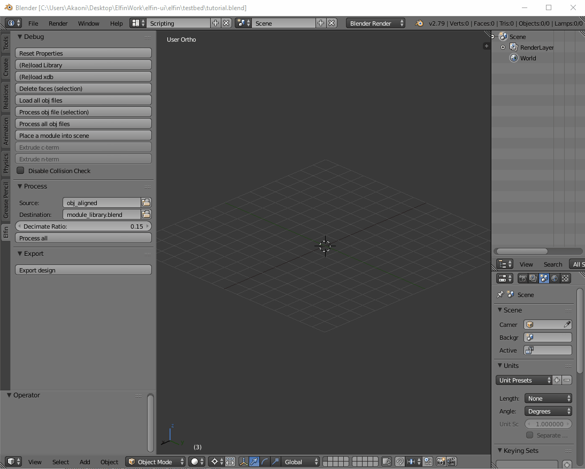
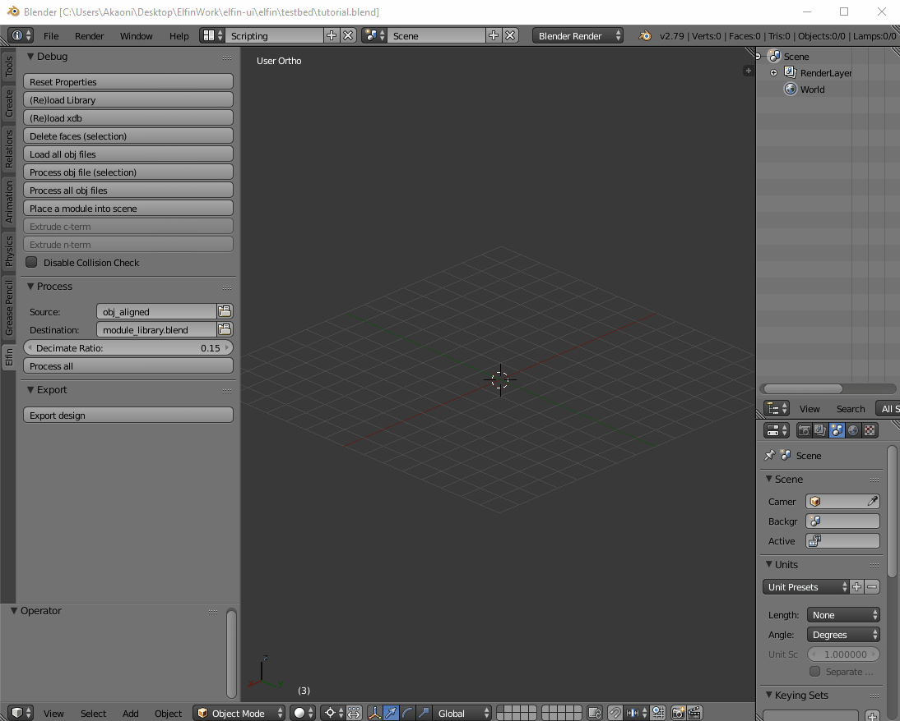
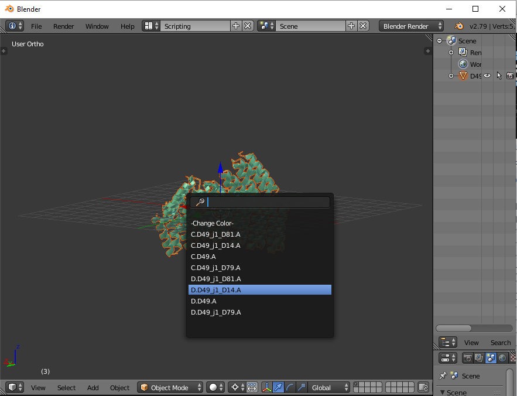

# Tutotial Content
1. [Installing](#installing)
2. [Updating](#updating)
3. [Usage](#usage)
4. [Operator List](#operator-list)
5. [Prototype Naming Convention](#prototype-naming-convention)
6. [Coloring](#coloring)
7. [Mirror-Linking](#mirror-linking)
8. [Useful Blender Shortcuts](#useful-blender-shortcuts)
9. [Collision Detection](#collision-detection)

# Installing


```
git clone --depth 1 git@github.com:joy13975/elfin-ui
cd elfin-ui
./install
```

This should work for Linux/MacOS/WSL.

For "pure" Windows (non-WSL), either copy the `elfin` folder to your Blender's addon directory or create a symlink via `mklink` or [Shell Link Extension](http://schinagl.priv.at/nt/hardlinkshellext/linkshellextension.html)

After installing, open Blender and go to `File > User Preferences > Add-ons` and search for `Elfin`. If the installation was successful there should be a `Elfin: Elfin UI`. Tick the box and make sure to `Save User Settings` (bottom-left).

<p align="center">

</p>

Before enabling, your Blender probably looks like:
<p align="center">

</p>

After enabling, your Blender should look like:
<p align="center">

</p>

Notice that the left-hand-side panel now has an `elfin` section with some debug buttons. You don't need to touch these buttons as they are for debugging. You might sometimes find a need for disabling collision detection or resetting the properties. There are facilities for processing PyMol-generated .obj module models but for now we don't need to get into that.


# Updating

To update to the latest elfin-ui, simply pull (inside elfin-ui root folder):

`git pull`

The module library files are automatically fetched by `./install` but if in any case the module library was lost, modified, or became outdated, do:

`./fetch_library`

# Usage
The design paradigm of elfin-ui revolves around module assembly. This means the user is expected to creat modules, extrude from modules, move/rotate networks around, and draw path guides (upcoming feature which calls into elfin-solver for automatic segment creation).

All functionalities of the Elfin UI addon are accessed via what Blender calls "operators". Basically, when your mouse is within the viewport you can hit <kbd>space</kbd> to bring up a search menu that lets you type in the name of the operator.

The following are some basic examples of creating and manipulating modules.

## Adding a Module

There are two ways to spawn a single/hub module into the scene: through the `Add Module` operator or through Blender's primitives menu (<kbd>shift</kbd>+<kbd>a</kbd>). The former is more flexible because you can search the prototype list by typing the name instead of scrolling around. Below is a demonstration.

Move the cursor into Blender's viewport and hit <kbd>space</kbd>. Type in `place` and one item should read `Elfin: Add (place) a module` (the GIF is a bit outdated but the process is the same):

<p align="center">

</p>

Hit <kbd>enter</kbd> and a prototype list should be displayed. You can select the module you want to place, or select `-Change Color-` in order to set the color before loading in the module's model. The selected module should get placed at origin in its default orientation.

<b>Note: </b> double modules are deliberately disabled, because they do not serve a purpose in elfin-ui's design paradigm.

<b>Optional: color setting.</b> Now that `Add Module` is activated, you can move your cursor away and set the color for the new module before loading the actual model by using the Operator Properties panel at the bottom-left corner. You don't have to do this because elfin-ui sets a new color randomly for each new module. You <em>can</em> still change the color after loading the model, but if you do that through the Operator Properties panel it will cause lag as Blender removes the model it had loaded and re-loads a new one with a different color. If you've already loaded the model and want to change the color, go into the lower half of the right-hand-side panel, find the `Material` tab (with a copper-colored ball icon) and you can change it there without causing lag.

<b>Optional: re-select prototype.</b> The Operator Properties panel also lets you "redo" - that is to choose again the module prototype to add (this is the same as viewport's prototype list).

## Extrusion

Again, hit <kbd>space</kbd> with the cursor in Blender's viewport. Type in `ext` and one item should read `Elfin: Extrude Module`. After selecting this item, a a list of extrudable termini will be displayed. If a terminus is occupied by an existing module, this list will filter accordingly. When prompted, select which terminus: `N` or `C`, to extrude. Then, choose your desired module.

In the following GIF I chose to extrude at the C-Terminus, then chose `-Change Color-`.

<p align="center">

</p>

Select the module prototype the same way as with `Add Module`.

## Mirror Linking

Originally designed for enforcing symmetric hubs' arm identiticality, mirror linking cause simultaneous manipulation for two or more separate modules that are not necessarily spatially related.

When modules are <em>mirror-linked</em> (or <em>linked-by-mirror</em>), they are called a group of "mirrors". Any extrusion or deletion applied on any one of the mirrors will also be applied on the rest of the linked mirrors. Further, modules that are a result of extrusion from any mirror will also be automatically mirror-linked (between the new set of modules).

To link modules by mirror, search for `link by`. One item should read `Elfin: Link multiple modules of the same prototype by mirror`:

<p align="center">

</p>

Selected modules must be of the same prototype. 

If the linking was successful a message should be shown. If the selected modules already have mirrors linked, you will get a warning and a choice as to whether or not to replace existing links with new ones.

You can also list the mirrors of a module with the List Mirror opereator. You can select all mirrors of the currently selected module with `Select Mirrors`.

Try deleting one of the extruded modules and see what happens. Revert using <kbd>cmd</kbd>+<kbd>z</kbd> (<kbd>ctrl</kbd> for Windows and Linux).

Mirrors can have any location and rotation - they do not need to be identical. You can even move them (as long as you move the connected modules together) and they will stay linked.

<b>Helpful to know</b>: extruding from symmetric hubs are automatically mirror-linked. 

# Operator List

## Export
 * `Export`
    * Exports the networks in the current scene to a elfin-core readable input file.
    * Short form: `#exp`

## Import
 * `Import`
    * Imports elfin-solver output JSON.
    * Does not support importing elfin-ui exported JSON yet (what!).
    * Short form: `#imp`

## Module Related
 * `Add Module` (formerly called "Place Module")
    * Adds a new module to the scene at origin or the current selection.
    * Short form: `#addm` 
    * Automatically creates a new network and places the newly added module und er that network.
    * Only available <b>when nothing is selected</b>.
 * `Extrude Module` 
    * Add a module to the N- or C-Terminus of the selected module.
    * Short form: `#exm`
    * Only available <b>when one or more modules are selected</b>.

## Module Network Related
 * `Select Network Parent`
    * Selects the network parent object (arrow axes) the selected module(s) belong to.
    * Short form: `#snp`
    * Only available <b>when at least one module or joint is selected</b>.
    * Works for path guide objects too.
 * `Select Network Objects`
    * Selects all objects belonging to the same network as the selected objects.
    * Short form: `#sno`
    * Only available <b>when at least one module or joint is selected</b>.
    * Works for path guide objects too.
 * `Sever Network`
    * Sever one network into two at the specific point.
    * Short form: `#svnw`
    * Only available <b>when exactly two neighboring modules are selected</b>.
 * `Join Network`
    * Join two compatible networks; deletes the network that becomes empty.
    * Short form: `#jnw`
    * Only available <b>when exactly two modules are selected</b>. 
    * A list containing termini join options will be displayed, which will be empty if the two modules are
      * from the same network,
      * incompatible,
      * or compatible termini are already occupied by some other module.

## Path Guide Related
 * `Add Joint`
    * Add a path guide joint.
    * Short form: `#addj`
    * Only available <b>when the selection does not contain joints</b>.
 * `Extrude Joint`
    * Extrude a path guide joint from another.
    * Short form: `#exj`
    * Only available <b>when the selection only contains joints</b>.
 * `Add Bridge`
    * Add a bridge between two joints.
    * Short form: `#addb`
    * Launches a modal operator that bridges any two selected joints (remember to hold shift between selections).
    * The modal operator will intelligently deselect the oldest selection after creating a bridge so that the newest joint does not need to be re-selected by the user.
    * The modal operator is active if the cursor is a "hand" cursor. Press <kbd>esc</kbd> to cancel (will delete any bridges created) or the mouse right button to complete the operation.
 * `Joint to Module`
    * Move a joint to the COM of a module.
    * Short form: `#jtm`
    * Only available <b>when exactly one module and one joint are selected</b>.
 * `Module to Joint`
    * Move a module and its network to a joint.
    * Short form: `#mtj`
    * Only available <b>when exactly one module and one joint are selected</b>.
 * `Set Translation Tolerance`
    * Set bridge translation tolerance.
    * Short form: `#bxt`
    * Only available <b>when exactly one bridge is selected</b>.
    * Tolerance is only considered if this bridge connects to a hinge.

## Mirror Related
 * `Link by Mirror`
    * Link multiple modules of the same prototype by mirror.
    * Short form: `#lbm`
    * Only available when one or more <b>homogenous modules</b> are selected (same prototype)
 * `Unlink Mirrors`
    * Unlink mirrors from all selected modules.
    * Short form: `#ulm`
    * Only available <b>when one or more modules are selected</b>.
 * `List Mirrors`
    * List mirror links of one selected module.
    * Short form: `#lmr`
    * Only available <b>when exactly one module is selected</b>.
 * `Select Mirror`
    * Selects all mirror-linked modules of the selected module(s).
    * Short form: `#smr`
    * Only available <b>when more than zero modules are selected</b>.


You don't have to type the full name of the module. For example, "extr" will bring up the `Extrude Module` operator.

# Prototype Naming Convention

<p align="center">

</p>

`Add Module` and `Extrude Module` will prompt you with a filtered list of actionable module names - let's call them <em>filtered prototypes</em>. There could be many modules in a scene, but modules with the same module name (not Blender name) are of the same prototype (like what classes are to objects). For extrusion, prototypes are filtered by compatibility and also terminus occupancy (i.e. is the N and/or C terminus already occupied?).

For `Add Module`, you will see that the name of each module is bounded by two period marks. These marks are sentinels which makes it easy to search the exact module one is looking for. Try typing just `D4` in `Add Module`, and see what happens when you type `.D4` or `D4.` or `.D4.`.

For `Extrude Module`, names are of the form `:<chain1>(<term1>) -> (<term2>)<chain2>:<name2>.`. The `chain1` and `term1` are chain ID and terminus type of the module being extruded from. The `term2`, `chain2`, and `name2` are corresponding attributes of the new module to be extruded into. For instance: when `D49` is selected and extrusion on the N terminus is chosen, one of the items in the list could be `:A(N) -> (C)A:D49_aC2_24.` This means the terminus `N` of chain `A` of `D49` can be extruded and connected to a yet-to-be-added `D49_aC2_24` hub. In the latter, terminus `C` of chain `A` would be used for this connection.

The first letter, if there is one, denotes the <b>C Terminus</b> chain ID of the extrusion. This is needed because hub modules have more than one chain to extrude to and from.

The last letter is therefore the <b>N Terminus</b> chain ID in the to-be-extruded module.

# Coloring
The colour of each newly added module is set randomly. If you wish to set them manually, you can open the left-hand-side panel (via <kbd>t</kbd>) to adjust the color when the operator is <em>active</em> (when you've selected it after typing it). It's highly recommended that you change the color while the prototype selection is set to the `-Change Color-` placeholder. This is because with each color change Blender removes the object it added and re-adds it with a different color. That can cause considerable lag if you drag the colour sampler around the palette. You can also go into the material of the module object on the right-most side panel when the operator options are gone.

# Mirror-Linking
Mirror-linking was originally implemented to enforce symmetric execution of extrusion or deletion on the arms of a symmetric hub. I thought this could be potentially useful for manual design so I've made this available to the user via operators.

Mirror-linked modules essentially share extrusion and deletion operations. That means if you select just one of a mirror-linked group of modules and do extrusion on it, all other mirror-linked modules will also receive the same operation

# Useful Blender shortcuts:
 * <kbd>a</kbd> toggle select all/deselect all
 * <kbd>c</kbd> brush-select
 * <kbd>x</kbd> delete selection (with confirmation)
 * <kbd>r</kbd> rotate selection
 * <kbd>g</kbd> translate selection
 * <kbd>s</kbd> scale selection. <b>WARNING: Never scale modules. We need to keep the scale factor!</b>
 * <kbd>t</kbd> toggle left-hand-side panel (which has the Operator Properties panel)
 * <kbd>n</kbd> toggle right-hand-side panel (which has properties such as location, rotation and many more)
 * <kbd>cmd</kbd>+<kbd>z</kbd> undo
 * <kbd>cmd</kbd>+<kbd>shift</kbd>+<kbd>z</kbd> redo

Where <kbd>cmd</kbd> is involved, it's <kbd>ctrl</kbd> for Windows and Linux

# Collision Detection
By default collision detection is done on extrusion and placement of modules. The calculation is not perfect because we're using single module 3D models instead of their true atomic representation. If for any reason you need to disable this, you can find the tickbox in the left-hand-side panel (toggle by <kbd>t</kbd>).